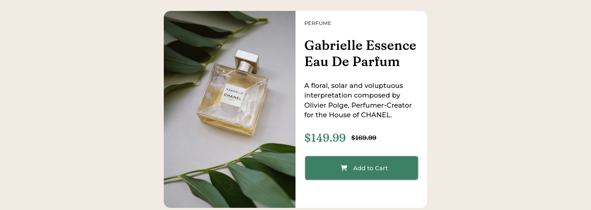
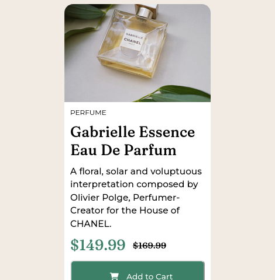

# Frontend Mentor - Product preview card component solution

This is a solution to the [Product preview card component challenge on Frontend Mentor](https://www.frontendmentor.io/challenges/product-preview-card-component-GO7UmttRfa). Frontend Mentor challenges help you improve your coding skills by building realistic projects.

## Table of contents

- [Overview](#overview)
  - [The challenge](#the-challenge)
  - [Screenshot](#screenshot)
  - [Links](#links)
- [My process](#my-process)
  - [Built with](#built-with)
  - [What I learned](#what-i-learned)
  - [Continued development](#continued-development)
  - [Useful resources](#useful-resources)
- [Author](#author)


## Overview

### The challenge

Users should be able to:

- View the optimal layout depending on their device's screen size
- See hover and focus states for interactive elements

### Screenshot of Desktop Design


### Screenshot of Mobile Design


### Links

- Solution URL: [Github](https://github.com/codinci/product-card-component)
- Live Site URL: [Github Page](https://codinci.github.io/product-card-component/)

## My process

### Built with

- Semantic HTML5 markup
- CSS custom properties
- Flexbox
### What I learned
The following are some of the things I learnt designing this project
<ul>
  <li>Use of flexbox design</li>

  ```css
  .container {
    display: flex;
    justify-content: center;
    align-items: center;
  }
  ```
  <li>A div filling up its parent's width</li>

  ```css
  .card-image {
        width: auto;
        max-height: 35%;
    }
```
<li>Use of content to select an image</li>

```css
  img {
        content: url('../images/image-product-mobile.jpg');
        border-top-left-radius: var(--content-radius);
        border-top-right-radius: var(--content-radius);
        border-bottom-left-radius: 0%;
        width: 100%;
  }
```

</ul>


### Continued development

I'd like to add styling to the button when a user clicks on it.

### Useful resources

- [Stackoverflow](https://stackoverflow.com/) - A developer's true friend when maneuvering code that just doesn't seem to work.
- [W3 Schools](https://www.w3schools.com) - This site helped me apply various stylings on the page.
- [Fontawesome](https://fontawesome.com) - This site assisted me with icon used on the page.

## Author

- Frontend Mentor - [codinci](https://www.frontendmentor.io/profile/codinci)
- LinkedIn - [David Mburu](https://www.linkedin.com/in/david-mburu-523059127/)

